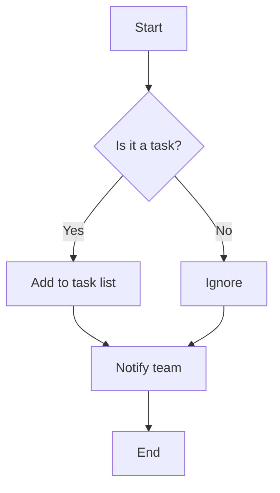

# Project Spec: My team's tasks app

## Objective

- Build a web app for small teams to manage tasks...

## Tech Stack

- React 18+, TypeScript, Vite, Tailwind CSS
- Node.js/Express backend, PostgreSQL, Prisma ORM

## Commands

- Build: `npm run build` (compiles TypeScript, outputs to dist/)
- Test: `npm test` (runs Jest, must pass before commits)
- Lint: `npm run lint --fix` (auto-fixes ESLint errors)

## Project Structure

- `src/` – Application source code
- `tests/` – Unit and integration tests
- `docs/` – Documentation

## Boundaries

- ✅ Always: Run tests before commits, follow naming conventions
- ⚠️ Ask first: Database schema changes, adding dependencies
- 🚫 Never: Commit secrets, edit node_modules/, modify CI config

# Hardware

- ULANZI TC001 Smart Pixel Clock

# Ref docs
My Coding Style -> https://github.com/Jelloeater/activitywatch-mcp-server-py
API -> https://github.com/Blueforcer/awtrix3
